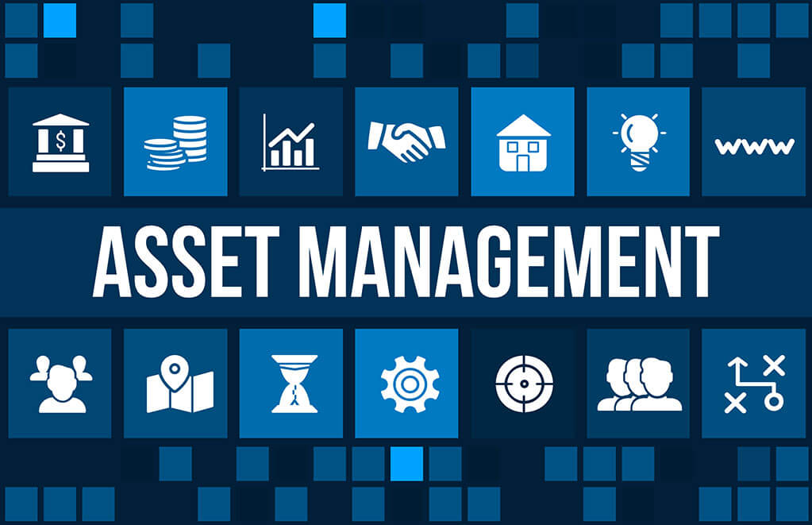

 
 
 

## Versor Investments -  
### [www.versorinvest.com](https://www.versorinvest.com)
 

In 2014 Deepak Guranani founded Versor Investments. A boutique hedge fund that creates diversified sources of absolute returns across multiple asset classes. Within a scientific, hypothesis-driven framework, Versor leverages modern stgatistical methods and vast datasets to drive every step of the investment process. Alpha forecast models, portfolio construction, and the trading process rely on the ingenuity and mathematical expertise of 60+ investment proffessionals. 

## 3.4 Billion in Assets Under Managment

* Currently have 3.4 Billion in Assets Under Management. 60 Employees

Combing a scientific hypothesis-driven approach with diverse data sources to systematically generate unique sources.

With Quantatative Finance. Trading without emotion, Historical data driven strategy. Risk Management, Portfolio Diversification

## Fund Founders and Profiles- 

Over 100 years in Extensive Hedge Fund research and experience. 

* [Deepak Gurnani](https://www.linkedin.com/in/deepak-gurnani-03551813) 
* [Ludger Hentschel](https://www.linkedin.com/in/ludger-hentschel) 
* [DeWayne Louis](https://www.linkedin.com/in/dewaynelouis) 
* [Andrew Flynn](https://www.linkedin.com/in/andrew-m-flynn-2305b716) 
* [Nirav Shah](https://www.linkedin.com/in/nirav-shah-8047b7)

# Technology

## Technologies Systematic - Investing Toolkit

### Forecasting (Machine Learning / Statistics)
* Return, risk
* correlation 
* trading volume
* probability of merger success

### Data Analysis
* Market data (prices, returns, volumes)
* Financial data (sales, earnings)
* Economic data (growth, inflation	
* Alternative data (news stories, credit card transactions.

### Programming 
* Python
* .Net
* SQL

### Mathematics 
* Linear Algebra / Calculus 

### Data
* Social Media Feeds
* News Articles
* Credit Card Data
* Jobs Data
* Earnings Call Transcripts

Cutting-edge research into investing, arguably the only firm in Asia
Access to large amounts of financial data and computing resources to facilitate research.

* Scientific, data-intensive investment process
* Differentiated approach
* Deep and experienced team of 60+ specialist
* 200+ human work years spent on developing superior research and trading technology

# Investment Strategies

## Versor Global Equities Tactical Trading (GETT)
Seeks to take advantage of price differentials between related financial instruments on a beta neutral basis using macroeconomic-based alpha forecast models across equity index futures (developed and emerging markets). The strategy aims to provide convexity.
*Strategy Inception: August 2017*

## Versor GETT Directional
GETT Directional combines beta one exposure to the S&P 500 index with the Versor Global Equities Trading (GETT) alpha engine. The strategy seeks to outperform the benchmark by enhancing S&P 500 returns in up markets and offsetting losses in down markets.
*Strategy Inception: August 2017*

## Versor Merger Arbitrage
Versor Merger Arbitrage is an active fundamental investment strategy combined with systematic processes and technology. The portfolio relies on a comprehensive proprietary database of 4000+ deals since 2000. Deals are sized based on several events such as deal closure probability, competing bid probability, downside risk, etc.
*Strategy Inception: May 2017*

## Versor Value Dislocation Opportunities
Versor Value Dislocation Opportunities is a market-neutral strategy with an investable universe of $3,000+ equities. The strategy invests 80% of portfolio risk in value styles with the remainder in other alpha factor themes. The portfolio is market-neutral down to the industry level. The strategy seeks to exploit an investment opportunity due to unusually wide value spreads.
*Strategy Inception: January 2020*

## Versor Trend Following
Versor Trend Following derives absolute returns from long, medium and short-term directional moves in various markets. The strategy invests in 100+ futures and forwards contracts across four major asset classes globally: commodities, equities, fixed income, and currency markets.
*Strategy Inception: May 2017*

## Versor Global Macro
Versor Global Macro seeks to take advantage of price differentials between related financial instruments on a beta neutral basis using macroeconomic-based alpha forecast models across commodities, equities, bonds, and currency markets. The strategy aims to provide convexity.
*Strategy Inception: August 2017*

# Competition

* Renessaince Technologies, 
* Citadel, 
* DE Shaw, 
* Two Sigma, 
* Alpha Simplex Group,
* Capula, 
* AQR Capital, 
* PanAgora, 
* Acadian Asset Managment

## Recommendations

*  Reccomendations for Versor would be the implementation of (High Frequency Trading)

* High frequency trading would increase returns exponentially as well as benefit greater during down markets

* High frequency trading would require the most high performance hardware and networking technologies. With an addition of C++ being utilized within the source code.

* Why are these technologies appropriate for your solution?

## Links and References
* [Versor Investment Website](https://www.versorinvest.com)

* [Placement Talk Versor Investments](https://youtu.be/KjQJP2mwntc)